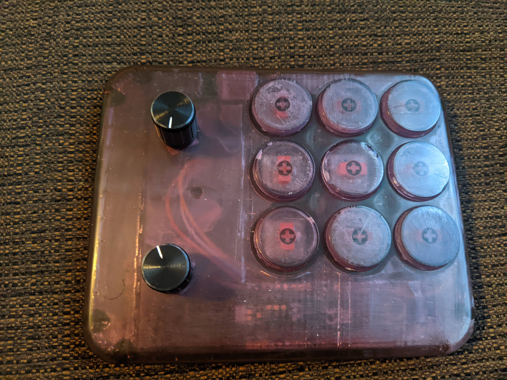
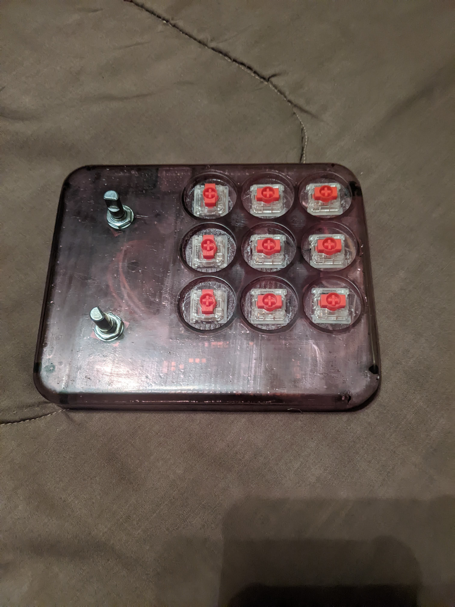

# Lightroom-Controller
A basic device for controlling a few photo editing tools in Lightroom Classic made for my sister Rachel. Made with a Raspberry Pi Pico and Circuitpython.

Components: 
  2 KY-040 Rotary Encoders 
  9 Gateron KS-33 Low Profile Keyswitches(Linear) 
  1 Raspberry Pi Pico 
 
Materials: 
  ~300ml Flashforge Transparent UV-Resin 
  Assored Stranded Copper Wire 
  Lead-free Solder 
 
Tools: 
  Creality ld-002r SLA Printer 
  Fusion-360 
  VSCode 
 
Libraries: 
  Circuitpython 
  Adafruit HID  
  Adafruit Ticks   
   
Rotary Encoder Knobs: https://www.thingiverse.com/thing:2797118
 
 
The Finished Product(looks aren't everything ok): 

 

